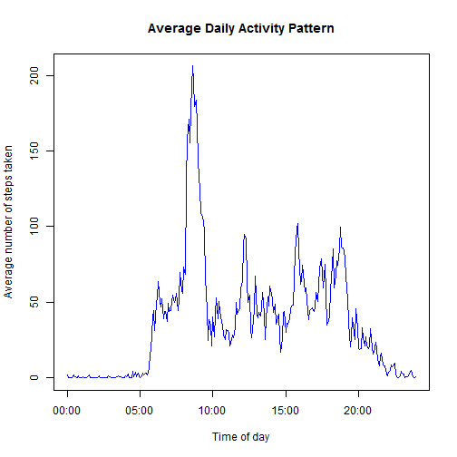

<<<<<<< HEAD
Assignment 1 for Reproducible Research
======================================

----------------------------------
Loading and preprocessing the data
----------------------------------

Show any code that is needed to

1. Load the data (i.e. `read.csv()`)

2. Process/transform the data (if necessary) into a format suitable for your analysis


```r
df <- read.csv("activity.csv")
dim(df)
```

```
## [1] 17568     3
```

```r
str(df)
```

```
## 'data.frame':	17568 obs. of  3 variables:
##  $ steps   : int  NA NA NA NA NA NA NA NA NA NA ...
##  $ date    : Factor w/ 61 levels "2012-10-01","2012-10-02",..: 1 1 1 1 1 1 1 1 1 1 ...
##  $ interval: int  0 5 10 15 20 25 30 35 40 45 ...
```

```r
head(df)
```

```
##   steps       date interval
## 1    NA 2012-10-01        0
## 2    NA 2012-10-01        5
## 3    NA 2012-10-01       10
## 4    NA 2012-10-01       15
## 5    NA 2012-10-01       20
## 6    NA 2012-10-01       25
```

```r

# convert factor date values to character strings
mydate <- as.character(df$date)

# convert integer time values such as 105 to character strings such as
# 01:05:00
mytime <- sprintf("%02d:%02d:00", df$interval%/%100, df$interval%%100)

# concatenate the date and time information, convert it to the POSIXlt
# class, and append it to the the data frame
datetime <- paste(mydate, mytime)
df$datetime <- strptime(datetime, "%Y-%m-%d %H:%M:%S")

# view some info about the data frame
str(df)
```

```
## 'data.frame':	17568 obs. of  4 variables:
##  $ steps   : int  NA NA NA NA NA NA NA NA NA NA ...
##  $ date    : Factor w/ 61 levels "2012-10-01","2012-10-02",..: 1 1 1 1 1 1 1 1 1 1 ...
##  $ interval: int  0 5 10 15 20 25 30 35 40 45 ...
##  $ datetime: POSIXlt, format: "2012-10-01 00:00:00" "2012-10-01 00:05:00" ...
```

```r
head(df)
```

```
##   steps       date interval            datetime
## 1    NA 2012-10-01        0 2012-10-01 00:00:00
## 2    NA 2012-10-01        5 2012-10-01 00:05:00
## 3    NA 2012-10-01       10 2012-10-01 00:10:00
## 4    NA 2012-10-01       15 2012-10-01 00:15:00
## 5    NA 2012-10-01       20 2012-10-01 00:20:00
## 6    NA 2012-10-01       25 2012-10-01 00:25:00
```

```r
tail(df)
```

```
##       steps       date interval            datetime
## 17563    NA 2012-11-30     2330 2012-11-30 23:30:00
## 17564    NA 2012-11-30     2335 2012-11-30 23:35:00
## 17565    NA 2012-11-30     2340 2012-11-30 23:40:00
## 17566    NA 2012-11-30     2345 2012-11-30 23:45:00
## 17567    NA 2012-11-30     2350 2012-11-30 23:50:00
## 17568    NA 2012-11-30     2355 2012-11-30 23:55:00
```


-------------------------------------------------
What is mean total number of steps taken per day?
-------------------------------------------------

For this part of the assignment, you can ignore the missing values in the dataset.

1. Make a histogram of the total number of steps taken each day.

2. Calculate and report the mean and median total number of steps taken per day.


```r
dailysteps <- sapply(split(df$steps, df$date), sum, na.rm = TRUE)
class(dailysteps)
```

```
## [1] "integer"
```

```r
hist(dailysteps, breaks = 20, main = "Histogram of Total Number of Steps Taken Per Day", 
    xlab = "Total Number of steps taken per day", ylab = "Frequency", col = "orange")
```

 

```r
mean(dailysteps)
```

```
## [1] 9354
```

```r
median(dailysteps)
```

```
## [1] 10395
```


Therefore, the median and mean number of steps taken per day are 9,354 and 10,395, respectively.


-------------------------------------------
What is the average daily activity pattern?
-------------------------------------------

1. Make a time series plot (i.e. `type = "l"`) of the 5-minute interval (x-axis) and the average number of steps taken, averaged across all days (y-axis)

2. Which 5-minute interval, on average across all the days in the dataset, contains the maximum number of steps?


```r
# Convert one day of datetime values from POSIXlt to POSIXct with just the
# time info.
fivemin <- as.POSIXct(df$datetime[1:288], format = "%H:%M")

# Split the steps into a list by the time interval factor, calculate the
# mean of each item in the list (removing NAs), and simplify the result.
fiveminavgsteps <- sapply(split(df$steps, df$interval), mean, na.rm = TRUE)

# Plot the time series
plot(fivemin, fiveminavgsteps, type = "l", main = "Average Daily Activity Pattern", 
    xlab = "Time of day", ylab = "Average number of steps taken", col = "blue")
```

 

```r


# Find the index of the time at which the max occurs using which.max, then
# substitute that index into fivemin, and use strftime to format the result
# nicely as a character string.
strftime(fivemin[which.max(fiveminavgsteps)], format = "%H:%M")
```

```
## [1] "08:35"
```


Therefore, the five-minute time interval from 8:35 - 8:40 AM contains the most steps on average across all the days in the data set.


-----------------------
Imputing missing values
-----------------------

Note that there are a number of days/intervals where there are missing values (coded as NA). The presence of missing days may introduce bias into some calculations or summaries of the data.

1. Calculate and report the total number of missing values in the dataset (i.e. the total number of rows with NAs)

2. Devise a strategy for filling in all of the missing values in the dataset. The strategy does not need to be sophisticated. For example, you could use the mean/median for that day, or the mean for that 5-minute interval, etc.

3. Create a new dataset that is equal to the original dataset but with the missing data filled in.

4. Make a histogram of the total number of steps taken each day and Calculate and report the mean and median total number of steps taken per day. Do these values differ from the estimates from the first part of the assignment? What is the impact of imputing missing data on the estimates of the total daily number of steps?


```r
# Count the number of missing values from the data set steps variable.
sum(is.na(df$steps))
```

```
## [1] 2304
```

```r

# Impute missing values in df$steps by the average number of steps for that
# time interval over all days in the data set.

# Create a logical vector that is TRUE when a value is NA
missing <- is.na(df$steps)

# Create a vector the same length as df$steps that has the average number of
# steps for each 5 minute time interval and repeats this info for every day
# in the data set.
df$dailyavgsteps <- rep(fiveminavgsteps, nrow(df)/288)

# Create a new data set equal to the old one, but with missing entries
# imputed from df$dailyavgsteps.
dfimputed <- df
dfimputed$steps[missing] <- df$dailyavgsteps[missing]

# Note: this also works for imputing, but it is **very** slow.  for (i in
# 1:nrow(df)) { imod <- i %% 288 if (imod == 0) { imod <- 288 } if
# (is.na(dfimputed$steps[i])) { dfimputed$steps[i] <- fiveminavgsteps[imod]
# } }

# Make a histogram of the total number of steps taken each day using the
# data with imputed values.
dailystepsimputed <- sapply(split(dfimputed$steps, dfimputed$date), sum, na.rm = TRUE)
hist(dailystepsimputed, breaks = 20, main = "Histogram of Total Number of Steps Taken Per Day (imputed data)", 
    xlab = "Total Number of steps taken per day", ylab = "Frequency", col = "orange")
```

 

```r
mean(dailystepsimputed)
```

```
## [1] 10766
```

```r
median(dailystepsimputed)
```

```
## [1] 10766
```


Therefore, there are 2,304 missing values for step counts over five minute time intervals in the data set, which amounts to approximately 8 days of missing values over a two-month time period.  When those missing values are imputed by the average number of steps during that five minute time interval taken over all the days for which there is data:

- The histogram for the data with missing values looks less smooth than the histogram for the data with imputed values.

- The average number of daily steps increases from 9,354 to 10,766 when going from the data with missing values to the data with imputed values, respectively.

- The median number of daily steps increases from 10,395 to 10,766 when going from the data with missing values to the data with imputed values, respectively.

- Imputing missing data on the estimates of the total daily number of steps seems to have had the effect of making the mean and median number of daily steps nearly equal to each other (I did not check for rounding of decimals).


-------------------------------------------------------------------------
Are there differences in activity patterns between weekdays and weekends?
-------------------------------------------------------------------------

For this part the `weekdays()` function may be of some help here. Use the dataset with the filled-in missing values for this part.

1. Create a new factor variable in the dataset with two levels - "weekday" and "weekend" indicating whether a given date is a weekday or weekend day.

2. Make a panel plot containing a time series plot (i.e. type = "l") of the 5-minute interval (x-axis) and the average number of steps taken, averaged across all weekday days or weekend days (y-axis). 


```r

# fiveminint <- sprintf('%02d:%02d', df$interval%/%100, df$interval%%100)
# strptime(fiveminint, '%H:%M')

# Create a character vector that tells the day of the week
dayofweek <- weekdays(dfimputed$datetime)


dfimputed$weekdayweekend <- as.factor(sapply(dayofweek, function(d) {
    if (d == "Sunday" | d == "Saturday") {
        return("weekend")
    } else {
        return("weekday")
    }
}))
class(dfimputed$weekdayweekend)
```

```
## [1] "factor"
```

```r

dfimputedweekday <- subset(dfimputed, weekdayweekend == "weekday")
dfimputedweekend <- subset(dfimputed, weekdayweekend == "weekend")


avgstepsweekday <- sapply(split(dfimputedweekday$steps, dfimputedweekday$interval), 
    mean, na.rm = TRUE)

avgstepsweekend <- sapply(split(dfimputedweekend$steps, dfimputedweekend$interval), 
    mean, na.rm = TRUE)


# Plot the time series
par(mfrow = c(1, 2))
plot(fivemin, avgstepsweekday, type = "l", main = "Average Daily Activity Pattern on Weekdays", 
    xlab = "Time of day", ylab = "Average number of steps taken", col = "blue")
plot(fivemin, avgstepsweekend, type = "l", main = "Average Daily Activity Pattern on Weekends", 
    xlab = "Time of day", ylab = "Average number of steps taken", col = "blue")
```

 

=======
# Reproducible Research: Peer Assessment 1


## Loading and preprocessing the data


## What is mean total number of steps taken per day?


## What is the average daily activity pattern?


## Imputing missing values


## Are there differences in activity patterns between weekdays and weekends?
>>>>>>> dc20c7c4e92aea6af318a611e2669d5b9c6cbfaf
